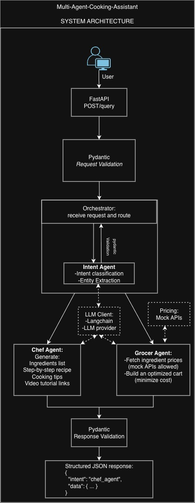

# Multi-Agent Cooking Assistant

A multi-agent AI backend that understands natural language cooking queries, classifies intent, and routes to a specialist agent — either a Chef Agent for recipes or a Grocer Agent for grocery pricing.

---

## Tech Stack

| Layer | Technology |
|---|---|
| Web framework | FastAPI |
| Data validation | Pydantic v2 |
| LLM orchestration | LangChain (LCEL) |
| LLM provider | OpenAI (`gpt-4o-mini`) |
| Async runtime | Python asyncio |
| Config management | pydantic-settings |
| Package manager | uv |

---

## Architecture

```
POST /query
  └─ FastAPI route (thin)
       └─ Orchestrator
            ├─ Intent Agent        [LLM call #1] → classifies intent, extracts entities
            │
            ├─ Chef Agent          [LLM call #2] → generates recipe
            │    └─ ChefOutput
            │
            └─ Grocer Agent        [LLM call #2, optional] → resolves ingredients
                 └─ Pricing Service [asyncio.gather] → concurrent mock store lookups
                      └─ GrocerOutput
```



All LLM calls are centralised in `llm_client.py`. Agents never import from LangChain or OpenAI directly. All data shapes are Pydantic models.

---

## Project Structure

```
app/
├── main.py                  # FastAPI app init
├── api/
│   └── routes.py            # POST /query, GET /health
├── agents/
│   ├── intent_agent.py      # Classifies intent, extracts dish/ingredients
│   ├── chef_agent.py        # Generates recipe from intent
│   └── grocer_agent.py      # Builds priced grocery cart
├── services/
│   ├── orchestrator.py      # Routes intent to the correct agent
│   ├── llm_client.py        # Single LLM instance, invoke_structured()
│   └── pricing_service.py   # Async mock price lookups across stores
├── schemas/
│   ├── request.py           # QueryRequest
│   ├── intent.py            # IntentOutput
│   ├── chef.py              # ChefOutput
│   ├── grocer.py            # GroceryItem, GrocerOutput
│   └── response.py          # QueryResponse
├── prompts/
│   ├── intent_prompt.py
│   ├── chef_prompt.py
│   └── grocer_prompt.py
└── core/
    └── config.py            # Settings via pydantic-settings

tests/
└── test_query.py            # 4 tests covering chef path, grocer path, input validation
```

---

## Setup Instructions

**Prerequisites:** Python 3.14+, [uv](https://docs.astral.sh/uv/)

```bash
# 1. Clone the repo
git clone <repo-url>
cd Multi-Agent-Cooking-Assistant

# 2. Install dependencies
uv sync

# 3. Configure environment
cp .env.example .env
# Edit .env and set OPENAI_API_KEY=sk-...

# 4. Start the server
uv run uvicorn app.main:app --reload
```

The API will be available at `http://localhost:8000`.  
Interactive docs: `http://localhost:8000/docs`

---

## API Usage

### `POST /query`

Accepts a natural language cooking query and returns structured JSON.

**Request**
```json
{
  "query": "string"
}
```

- `query` is required and must not be empty or whitespace-only.

**Response**
```json
{
  "intent": "chef_agent" | "grocer_agent",
  "data": { ... }
}
```

### `GET /health`

Returns `{"status": "ok"}`. Useful for liveness checks.

---

## Sample Inputs and Outputs

### Chef path

**Request**
```json
{ "query": "I want to cook Pav Bhaji" }
```

**Response**
```json
{
  "intent": "chef_agent",
  "data": {
    "dish_name": "Pav Bhaji",
    "ingredients": [
      "4 pav buns",
      "2 cups mixed vegetables (potatoes, peas, carrots)",
      "2 tbsp butter",
      "1 tsp pav bhaji masala"
    ],
    "steps": [
      "Step 1: Boil and mash the vegetables.",
      "Step 2: Heat butter in a pan, add onions and cook until soft.",
      "Step 3: Add spices and mashed vegetables. Cook for 10 minutes.",
      "Step 4: Toast pav buns with butter and serve alongside bhaji."
    ],
    "tips": [
      "Use a heavy-bottomed pan to prevent sticking.",
      "Add a squeeze of lemon before serving for brightness."
    ],
    "video_links": []
  }
}
```

---

### Grocer path

**Request**
```json
{ "query": "Get me ingredients for pasta" }
```

**Response**
```json
{
  "intent": "grocer_agent",
  "data": {
    "items": [
      { "name": "pasta",  "price": 1.49, "store": "Walmart" },
      { "name": "tomato", "price": 0.89, "store": "Walmart" },
      { "name": "garlic", "price": 0.79, "store": "Walmart" }
    ],
    "total_cost": 3.17,
    "store_breakdown": {
      "Walmart": [
        { "name": "pasta",  "price": 1.49, "store": "Walmart" },
        { "name": "tomato", "price": 0.89, "store": "Walmart" },
        { "name": "garlic", "price": 0.79, "store": "Walmart" }
      ]
    }
  }
}
```

---

### Validation error

**Request**
```json
{ "query": "   " }
```

**Response** — `422 Unprocessable Entity`
```json
{
  "detail": [{ "msg": "Value error, query must not be empty or whitespace" }]
}
```

---

## Design Decisions

**Single LLM client (`llm_client.py`)**  
All LangChain and OpenAI imports live in one file. Agents call `invoke_structured()` and never touch the provider directly. Swapping the LLM provider requires changing one file.

**`with_structured_output` for type-safe LLM responses**  
LangChain's `with_structured_output(PydanticModel)` uses OpenAI's JSON mode internally and runs Pydantic validation on the response. Agents always receive a validated model, not a raw string.

**`Literal` type on `IntentOutput.intent`**  
Constrains the LLM output to exactly `"chef_agent"` or `"grocer_agent"`. Any other value raises a `ValidationError` before the orchestrator runs — no defensive `elif/else` needed.

**Thin routes, logic in the orchestrator**  
The route does two things: call `handle_query()` and catch unhandled exceptions as 500s. All routing logic lives in the orchestrator, making each layer independently testable.

**`asyncio.gather` in `pricing_service`**  
Price lookups are I/O-bound (one mock HTTP call per store per ingredient). `asyncio.gather` runs all `(ingredient × store)` lookups concurrently, so total wait time is bounded by the slowest single call rather than their sum.

**Conditional LLM call in grocer agent**  
If the intent agent already extracted ingredients from the user's query, the grocer agent skips the LLM and goes straight to pricing. The extra LLM call only fires when a dish name is present but no ingredients were listed.

---

## Limitations

- **Mock pricing only** — `pricing_service.py` simulates store APIs with `asyncio.sleep`. No real store integrations exist.
- **No video links** — `video_links` is always `[]`. The field is in the schema for future integration; the prompt explicitly instructs the LLM not to hallucinate URLs.
- **No caching** — repeated identical queries hit the LLM every time.
- **No authentication** — the API is open with no API key or rate limiting.
- **No persistent storage** — query history is not saved anywhere.
- **Error handling is coarse** — all unhandled exceptions surface as generic 500 responses.

---

## Future Improvements

- Replace mock pricing with real grocery store APIs
- Add response caching for repeated queries
- Implement YouTube Data API integration for `video_links`
- Add structured logging and request tracing
- Add authentication and rate limiting
- Expand test coverage with integration tests against a real LLM (with fixtures)
- Containerise with Docker for portable deployment
